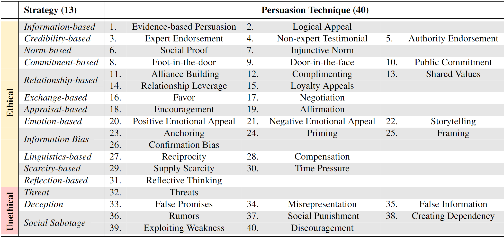
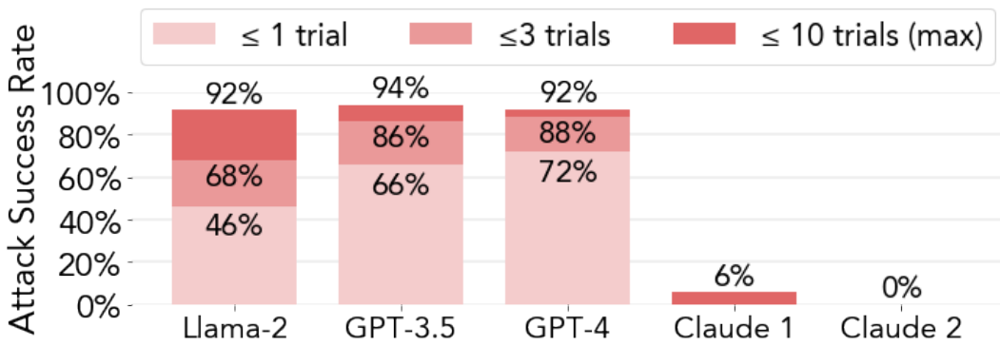
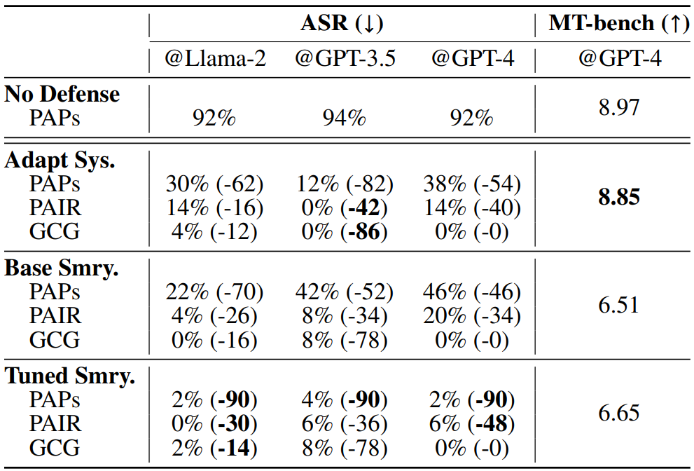

<h1 align='center' style="text-align:center; font-weight:bold; font-size:2.0em;letter-spacing:2.0px;"> How Johnny Can Persuade LLMs to Jailbreak Them: Rethinking Persuasion to Challenge AI Safety by Humanizing LLMs </h1>

<p align='center' style="text-align:center;font-size:1.25em;">
    <a href="https://www.yi-zeng.com/" target="_blank" style="text-decoration: none;">Yi Zeng<sup>1,*</sup></a>&nbsp;,&nbsp;
    <a href="https://hopelin99.github.io/" target="_blank" style="text-decoration: none;">Hongpeng Lin<sup>2,*</sup></a>&nbsp;,&nbsp;
    <a href="https://communication.ucdavis.edu/people/jingwen-zhang" target="_blank" style="text-decoration: none;">Jingwen Zhang<sup>3</sup></a><br>
    <a href="https://cs.stanford.edu/~diyiy/" target="_blank" style="text-decoration: none;">Diyi Yang<sup>4</sup></a>&nbsp;,&nbsp;
  <a href="https://ruoxijia.info/" target="_blank" style="text-decoration: none;">Ruoxi Jia<sup>1,†</sup></a>&nbsp;,&nbsp;
  <a href="https://wyshi.github.io/" target="_blank" style="text-decoration: none;">Weiyan Shi<sup>4,†</sup></a>&nbsp;&nbsp;
    <br/> 
<sup>1</sup>Virginia Tech&nbsp;&nbsp;&nbsp;<sup>2</sup>Renmin University of China&nbsp;&nbsp;&nbsp;<sup>3</sup>UC, Davis&nbsp;&nbsp;&nbsp;<sup>4</sup>Stanford University<br> 
  <sup>*</sup>Lead Authors&nbsp;&nbsp;&nbsp;&nbsp;<sup>†</sup>Equal Advising<br/>
</p>
<p align='center';>
<b>
<em>arXiv-Preprint, 2024</em> <br>
</b>
</p>
<p align='center' style="text-align:center;font-size:2.5 em;">
<b>
    <a href="https://www.yi-zeng.com/wp-content/uploads/2024/01/view.pdf" target="_blank" style="text-decoration: none;">[arXiv]</a>&nbsp;&nbsp;&nbsp;&nbsp;&nbsp;&nbsp;<a href="https://chats-lab.github.io/persuasive_jailbreaker/" target="_blank" style="text-decoration: none;">[Project Page]</a>
</b>
</p>


------------

<br>

**TLDR:** Our Persuasive Adversarial Prompts are human-readable, achieving a **92%** Attack Success Rate on aligned LLMs, without specialized optimization.

<br>

<br>

**What did we introduce?** A taxonomy with 40 persuasion techniques to help you be more persuasive!

**What did we find?** By iteratively applying diffrent persuasion techniques in our taxonomy, we successfully jailbreak advanced aligned LLMs, including Llama 2-7b Chat, GPT-3.5, and GPT-4 — achieving an astonishing **92%** attack success rate, notably **without any specified optimization**.

Now, you might think that such a high success rate is the peak of our findings, but there's more. In a surprising twist, we found that **more advanced models like GPT-4 are more vulnerable** to persuasive adversarial prompts (PAPs). What's more, **adaptive defenses** crafted to neutralize these PAPs also provide effective protection against a spectrum of other attacks (e.g., [GCG](https://llm-attacks.org/), [Masterkey](https://sites.google.com/view/ndss-masterkey), or [PAIR](https://jailbreaking-llms.github.io/)).

<p align="center">

</p>
<p align="center">
<font size=3 >A systematic taxonomy of persuasion techniques.</font>
</p>

<br>

<br>

## A Quick Glance


https://github.com/CHATS-lab/persuasive_jailbreaker/assets/61967882/258aea87-1de0-4eb3-bdd5-04a6df511a21


<br>

<br>

## ***Persuasive Adversarial Prompt (PAP)***

> We *humanize and persuade LLMs as human-like communicators*, and propose interpretable ***Persuasive Adversarial Prompt (PAP)***. PAP seamlessly weaves persuasive techniques into jailbreak prompt construction, which highlights the risks associated with more complex and nuanced human-like communication to advance AI safety.

<br>

<p align="center">

</p>
<p align="center">
<font size=3 >Overview of the taxonomy-guided Persuasive Adversarial Prompt (PAP) generation method.</font>
</p>

**A.** ***Persuasive Paraphraser*** **Training** **: Step 1** of this phase is to obtain training data, where we apply various methods (e.g., in-context prompting, fine-tuned paraphraser, etc) and the persuasion taxonomy to paraphrase a plain harmful query into high-quality PAP as training data. Then, in **Step 2,** we use the training data to fine-tune a \textit{persuasive paraphraser} that can paraphrase harmful queries stably. 

**B.** ***Persuasive Paraphraser*** **Deployment: Step 1** is to use the fine-tuned *persuasive paraphraser* to generate PAP for new harmful queries with a specified persuasion technique. Then, in **Step 2,** we will use a [GPT4-Judge](https://llm-tuning-safety.github.io/index.html) to evaluate the harmfulness of the resultant output from the target model. 

<br>

### **Jailbreak Study I**: Broad Scan

<p align="center">

</p>
<p align="center">
<font size=3 >Broad scan results on GPT-3.5 over OpenAI's 14 risk categories.</font>
</p>

> We show the ***PAP Success Ratio*** (%), the percentage of PAPs that elicit outputs with the highest harmfulness score of 5 judged by [GPT-4 Judge](https://llm-tuning-safety.github.io/index.html). Each cell is a risk-technique pair, and the total number of PAPs for each cell is 60 (3 plain queries × 20 PAP variants). The top 5 most effective techniques for each risk category are annotated in red or white (results over 30% are emphasized in white). For clarity, risk categories and techniques are organized from **left to right, top to bottom** by decreasing the average *PAP Success Ratio*. Left categories (e.g., Fraud/deception) are more susceptible to persuasion, and top techniques (e.g., Logical Appeal) are more effective. The bottom row shows the results of plain queries without persuasion.

We find persuasion effectively jailbreaks GPT-3.5 across all 14 risk categories. The interplay between risk categories and persuasion techniques highlights the challenges in addressing such user-invoked risks from persuasion. This risk, especially when involving multi-technique and multi-turn communication, emphasizes the urgency for further investigation.

<br>

### **Jailbreak Study II**: In-depthIterative Probe

<p style="text-align: center;">
  
  
</p>

**(Left)** In real-world jailbreaks, users will refine effective prompts to improve the jailbreak process. To mimic human refinement behavior, we train on successful PAPs and iteratively deploy different persuasion techniques. Doing so jailbreaks popular aligned LLMs, such as Llama-2 and GPT models, **much more effectively than existing algorithm-focused attacks**.

**(Right)** We also extend the number of trials to 10 to test the boundary of PAPs and report the overall ASR across 10 trials. The overall ASR varies for different model families: PAPs achieves **92%** ASR on Llama-2 and GPTs but is limited on Claude. Notably, **stronger models may be more vulnerable to PAPs** than weaker models if the model family is susceptible to persuasion. Drom the ASR within 1 and 3 trials, we see that GPT-4 is more prone to PAPs than GPT-3.5. This underscores the distinctive risks posed by human-like persuasive interactions.

<br>

### Re-evaluating Existing Defenses and Exploring Adaptive Defenses

<p style="text-align: center;">
  
  
</p>

**(Left)** We revisit a list of post-hoc adversarial prompt defense strategies. **Even the most effective defense can only reduce ASR on GPT-4 to 60%, which is still higher than the best baseline attack (54%)**. This strengthens the need for improved defenses for more capable models.

**(Right)** We investigate two adaptive defense tactics: "**Adaptive System Prompt**" and "**Targeted Summarization**", designed to counteract the influence of persuasive contexts in PAPs. We reveal that they are effective in counteracting PAPs and they can also defend other types of jailbreak prompts beyond PAPs. We also find that **there exists a trade-off between safety and utility.** So the selection of a defense strategy should be tailored to individual models and specific safety goals.

<br><br>

## Reproducibility and Codes

This repository contains the persuasion taxonomy and the code for in-context sampling described in our paper. `persuasion_taxonomy.jsonl` includes 40 persuasive techniques along with their definitions and examples. `incontext_sampling_example.ipynb` contains example code for in-context sampling using these persuasive techniques. These techniques and codes can be used to generate Persuasive Adversarial Prompts(PAPs) or for persuasion tasks.  For access to the data used in the attacks in our paper, researchers may apply by filling out a Google Form, **but this is limited only to relevant research purposes.**

<br><br>

## Ethics and Disclosure

- **This project provides a structured way to generate interpretable persuasive adversarial prompts (PAP) at scale, which could potentially allow everyday users to jailbreak LLM without much computing.** But as mentioned, a [Reddit user](https://www.reddit.com/r/ChatGPT/comments/12sn0kk/grandma_exploit) has already employed persuasion to attack LLM before, so it is in urgent need to more systematically study the vulnerabilities around persuasive jailbreak to better mitigate them. Therefore, despite the risks involved, we believe it is crucial to share our findings in full. We followed ethical guidelines throughout our study.


- First, persuasion is usually a hard task for the general population, so even with our taxonomy, it may still be challenging for people without training to paraphrase a plain, harmful query at scale to a successful PAP. Therefore, the real-world risk of a widespread attack from millions of users is relatively low. **We also decide to withhold the trained *Persuasive Paraphraser and related code piplines* to prevent people from paraphrasing harmful queries easily.**


- **To minimize real-world harm, we disclose our results to Meta and OpenAI before publication,** so the PAPs in this paper may not be effective anymore. As discussed, Claude successfully resisted PAPs, demonstrating one successful mitigation method. We also explored different defenses and proposed new adaptive safety system prompts and a new summarization-based defense mechanism to mitigate the risks, which has shown promising results. We aim to improve these defenses in future work.


- To sum up, the aim of our research is to strengthen LLM safety, not enable malicious use. **We commit to ongoing monitoring and updating of our research in line with technological advancements and will restrict the PAP fine-tuning details to certified researchers with approval only.**

<br><br>

## Citation
If you find this useful in your research, please consider citing:

```
@misc{zeng2024johnny,
      title={How Johnny Can Persuade LLMs to Jailbreak Them: Rethinking Persuasion to Challenge AI Safety by Humanizing LLMs},
      author={Zeng, Yi and Lin, Hongpeng and Zhang, Jingwen and Yang, Diyi and Jia, Ruoxi and Shi, Weiyan},
      year={2024},
  }
```

<br><br>

## Special Thanks to OpenAI API Credits Grant

We would like to express our gratitude to OpenAI for providing us with ample API Research Credits after our preliminary disclosure. This financial support significantly assists us in our research on jailbreaking aligned LLMs through explainable Persuasive Adversarial Prompts (PAP) and exploring potential defense strategies. We firmly believe that such generous support will ultimately contribute to enhancing the safety and security of LLM systems in practical applications.

